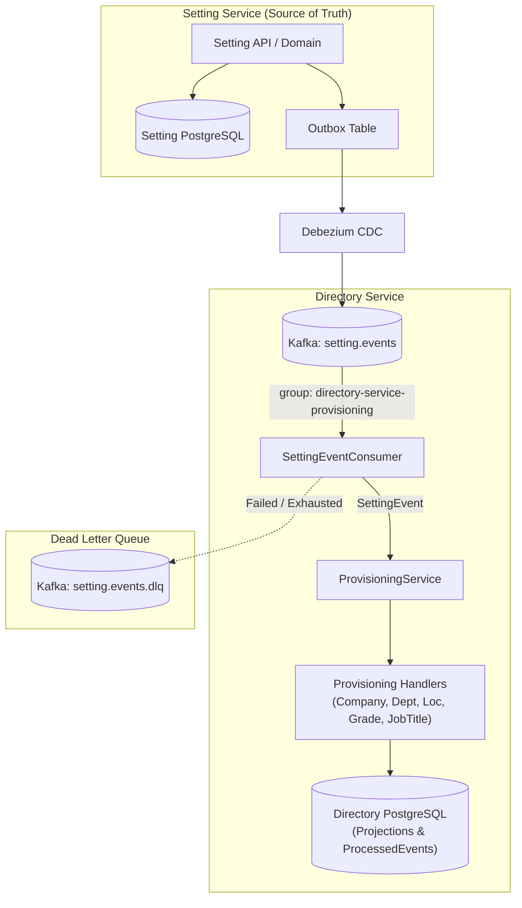
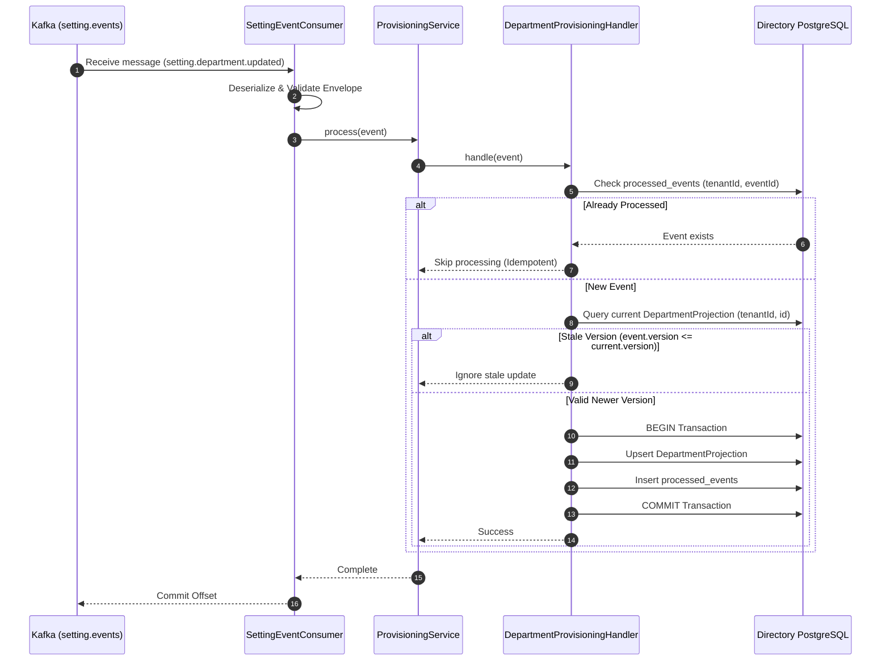
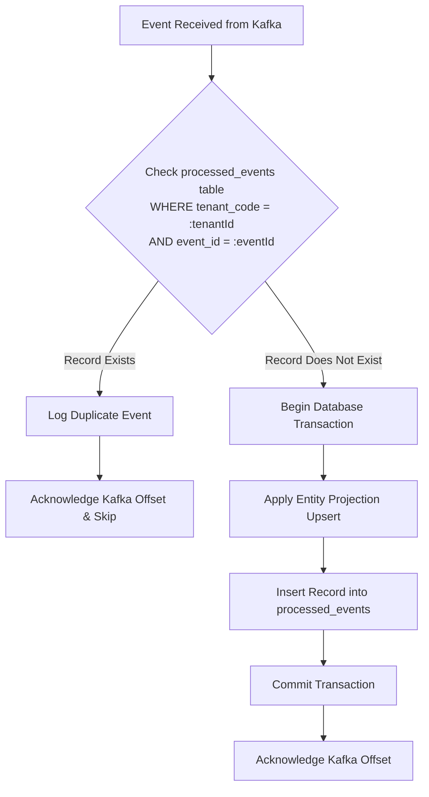
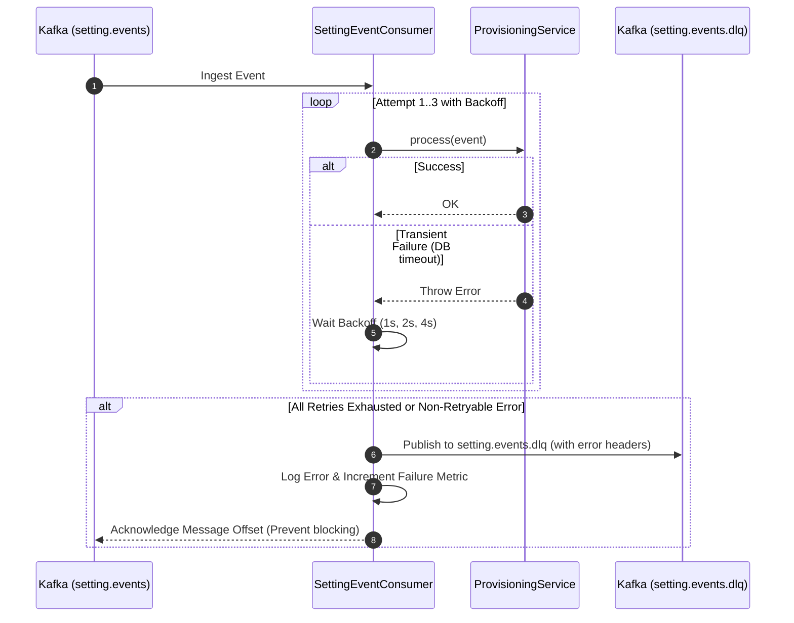
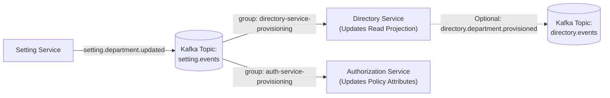

# Implementation Plan: Directory Service Provisioning Module

**Branch**: `003-directory-provisioning` | **Date**: 2026-09-26 | **Spec**: [specs/003-directory-provisioning/spec.md](file:///home/ren0503/new-hros/admin-module/directory-svc/specs/003-directory-provisioning/spec.md)

**Input**: Feature specification from `specs/003-directory-provisioning/spec.md`

## Summary

Implement the **Provisioning Module inside Directory Service** as an event-driven consumer module adhering to Clean Architecture principles. The module consumes organizational master data events published by Setting Service (`setting.company.*`, `setting.location.*`, `setting.department.*`, `setting.grade.*`, `setting.job_title.*`), validates and routes them through dedicated entity provisioning handlers, synchronizes local Directory read projections, enforces strict tenant isolation, ensures database-level idempotency via `processed_events`, handles out-of-order/stale versions, and provides robust retry/DLQ error handling.

---

## 1. Architecture Decision & Deliverables

### 1.1 Architecture Decisions
- **Source of Truth Separation**: Setting Service exclusively owns master-data domains (`Company`, `Location`, `Department`, `Grade`, `JobTitle`). Directory Service maintains read projections.
- **Consumer Isolation**: Directory Provisioning Module is an event-driven consumer and never serves write CRUD APIs for master data domains.
- **Clean Layering**: `SettingEventConsumer` (transport/deserialization) $\rightarrow$ `ProvisioningService` (routing) $\rightarrow$ Handlers (`CompanyProvisioningHandler`, etc.) $\rightarrow$ Projection Repositories $\rightarrow$ PostgreSQL.
- **Idempotency**: PostgreSQL `processed_events` table with unique constraint on `(tenant_code, event_id)` executed atomically within transactions.
- **Versioning**: Entity projection optimistic version checks (`eventVersion > currentVersion`) to ignore stale out-of-order events.
- **Resilience & DLQ**: Exponential backoff retries for transient DB errors; poison pills and exhausted retries routed to `setting.events.dlq`.

---

## 2. Technical Context

**Language/Version**: TypeScript 5.3.3 / Node.js >= 20 (Strict mode enabled: `strictNullChecks`, `noImplicitAny`, `strictPropertyInitialization`)

**Primary Dependencies**: NestJS 10.3, `@nestjs/microservices` 10.3, `kafkajs` 2.2.4, `@nestjs/typeorm` 10.0, `typeorm` 0.3.17, `@new-hros/libs-sql` 1.2.0, `@new-hros/libs-core` 1.3.2, `@new-hros/libs-events` 1.2.0, `class-validator` 0.14, `class-transformer` 0.5

**Storage**: PostgreSQL with TypeORM migrations (`processed_events`, `company_projections`, `department_projections`, `location_projections`, `grade_projections`, `job_title_projections`)

**Testing**: Jest 29.7 with unit tests for consumer, router, handlers, and repositories; Testcontainers for integration tests

**Target Platform**: Linux / Containerized Node.js Microservice

**Project Type**: NestJS Microservice (Kafka Event-Driven Consumer & Projection Engine)

**Performance Goals**: Event processing latency < 50ms per event; throughput > 500 events/sec

**Constraints**: Strict Constitution compliance (unidirectional layering, zero cross-service DB access, 100% tenant isolation)

---

## 3. Constitution Check

*GATE: Must pass before Phase 0 research. Re-check after Phase 1 design.*

| Principle | Check Item | Status | Notes |
|---|---|---|---|
| **I. Clean Architecture & Strict Layering** | Consumer $\rightarrow$ Service $\rightarrow$ Handler $\rightarrow$ Repository unidirectional flow; no business logic in consumer | ✅ PASS | Consumer only deserializes/validates and delegates to `ProvisioningService` |
| **II. Strict TypeScript & Type Safety** | `strict: true` compliance, zero `any`, explicit return types, immutable DTOs/interfaces | ✅ PASS | All contracts, payloads, and handlers strictly typed without `any` |
| **III. Domain Isolation & Explicit Contracts** | Zero cross-service DB queries; consumes versioned Kafka contracts via `setting.events` | ✅ PASS | Only consumes Kafka events; no database links to Setting Service |
| **IV. Data Integrity & Migrations** | TypeORM migrations with `up()` and `down()`, transactions for multi-statement writes, optimistic version checks | ✅ PASS | Migrations defined for all projection and idempotency tables; transaction-wrapped operations |
| **V. Unified Observability & Security** | Structured logging via `AppLogger`, multi-tenant scoping (`tenant_code` in all queries), Prometheus metrics | ✅ PASS | Scoped by `tenantCode`; metrics recorded on processing duration and success/failure |
| **VI. Testing Discipline** | Comprehensive unit & integration tests covering create, update, deactivate, duplicate, out-of-order, and DLQ | ✅ PASS | Target $\ge 90\%$ statement and $\ge 85\%$ branch coverage |

---

## 4. Mermaid Diagrams

### 4.1 Overall Architecture Diagram



### 4.2 Department Provisioning Sequence Diagram



### 4.3 Idempotency Strategy Flowchart



### 4.4 Retry & DLQ Sequence Diagram



### 4.5 Authorization Integration Architecture



---

## 5. NestJS Project Structure

```text
src/
├── common/
│   ├── enums/
│   │   ├── table-name.ts                      # Updated with projection & processed_events tables
│   │   ├── setting-event-type.enum.ts         # setting.* event types
│   │   └── index.ts
│   └── interfaces/
│       ├── setting-event.interface.ts         # SettingEvent<T> contract
│       └── index.ts
├── modules/
│   ├── provisioning/
│   │   ├── consumers/
│   │   │   ├── setting-event.consumer.ts      # Kafka listener for setting.events
│   │   │   └── index.ts
│   │   ├── services/
│   │   │   ├── provisioning.service.ts        # Router service
│   │   │   └── index.ts
│   │   ├── handlers/
│   │   │   ├── base-provisioning.handler.ts
│   │   │   ├── company-provisioning.handler.ts
│   │   │   ├── department-provisioning.handler.ts
│   │   │   ├── location-provisioning.handler.ts
│   │   │   ├── grade-provisioning.handler.ts
│   │   │   ├── job-title-provisioning.handler.ts
│   │   │   └── index.ts
│   │   ├── entities/
│   │   │   ├── processed-event.entity.ts
│   │   │   ├── company-projection.entity.ts
│   │   │   ├── department-projection.entity.ts
│   │   │   ├── location-projection.entity.ts
│   │   │   ├── grade-projection.entity.ts
│   │   │   ├── job-title-projection.entity.ts
│   │   │   └── index.ts
│   │   ├── repositories/
│   │   │   ├── processed-event.repository.ts
│   │   │   ├── company-projection.repository.ts
│   │   │   ├── department-projection.repository.ts
│   │   │   ├── location-projection.repository.ts
│   │   │   ├── grade-projection.repository.ts
│   │   │   ├── job-title-projection.repository.ts
│   │   │   └── index.ts
│   │   ├── dto/
│   │   │   ├── company-event.dto.ts
│   │   │   ├── department-event.dto.ts
│   │   │   ├── location-event.dto.ts
│   │   │   ├── grade-event.dto.ts
│   │   │   ├── job-title-event.dto.ts
│   │   │   └── index.ts
│   │   ├── errors/
│   │   │   ├── unsupported-event.error.ts
│   │   │   └── index.ts
│   │   ├── provisioning.module.ts
│   │   └── index.ts
```

---

## 6. Granular Implementation Tasks

1. **Phase 1: Common Enums & Event Contracts**
   - Create `setting-event-type.enum.ts` and update `table-name.ts` with projection tables.
   - Define `SettingEvent<T>` interface and specific payload contracts.
2. **Phase 2: Database Entities & Repositories**
   - Create `ProcessedEventEntity` and `ProcessedEventRepository`.
   - Create projection entities and repositories for `Company`, `Department`, `Location`, `Grade`, `JobTitle`.
   - Write TypeORM migration for projection and processed events tables.
3. **Phase 3: Handlers & Provisioning Service**
   - Implement `CompanyProvisioningHandler`, `DepartmentProvisioningHandler`, `LocationProvisioningHandler`, `GradeProvisioningHandler`, `JobTitleProvisioningHandler` with idempotency, versioning, and transaction support.
   - Implement `ProvisioningService` event router.
4. **Phase 4: Consumer, Error Handling, Retry & DLQ**
   - Implement `SettingEventConsumer` subscribing to `setting.events` with consumer group `directory-service-provisioning`.
   - Implement exponential backoff retry and DLQ forwarding to `setting.events.dlq`.
5. **Phase 5: Module Wiring & Observability**
   - Wire `ProvisioningModule` into `AppModule`.
   - Add structured logging and metrics instrumentation.
6. **Phase 6: Testing & Quality Gates**
   - Write comprehensive unit tests for all handlers, services, and consumer components.
   - Write integration tests verifying idempotent handling, version checks, and multi-tenant isolation.
