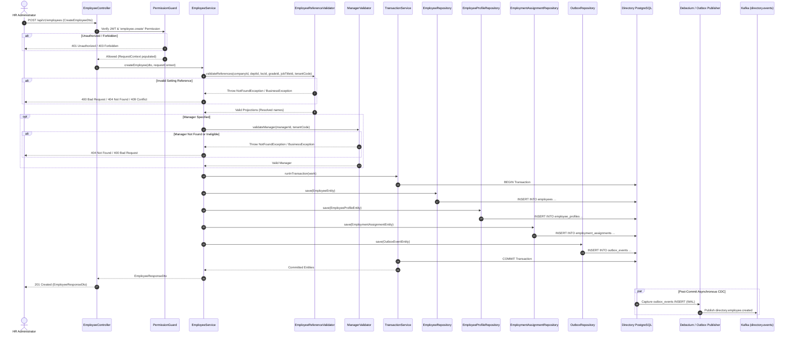

# Implementation Plan: Create Employee API in Directory Service

**Branch**: `004-create-employee-api` | **Date**: 2026-09-26 | **Spec**: [specs/004-create-employee-api/spec.md](file:///home/ren0503/new-hros/admin-module/directory-svc/specs/004-create-employee-api/spec.md)

**Input**: Feature specification from `specs/004-create-employee-api/spec.md`

---

## Summary

Design and implement the **Create Employee API** (`POST /api/v1/employees`) in the HROS Directory Service following Clean Architecture principles and strict polyrepo domain boundaries. Directory Service acts as the authoritative source of truth for `Employee`, `EmployeeProfile`, and `EmploymentAssignment`, while validating organizational master data references (`Company`, `Department`, `Location`, `Grade`, `JobTitle`) against synchronized local read projections populated by the Provisioning Module (`specs/003-directory-provisioning`). All multi-entity writes and outbox event creation (`directory.employee.created`) are committed inside a single atomic PostgreSQL transaction to ensure full data consistency and reliable downstream asynchronous propagation via Kafka.

---

## 1. Create Employee API Specification

### Endpoint Definition
- **HTTP Method**: `POST`
- **URI Path**: `/api/v1/employees` (or `/employees` with global prefix `/api/v1`)
- **Authentication**: Bearer Token (RS256 JWT containing `sub` / `userId`, `tenantCode` / `tenantId`, `permissions`)
- **Authorization**: Requires permission `employee.create`
- **Headers**:
  - `Authorization`: `Bearer <token>` (Required)
  - `Content-Type`: `application/json` (Required)
  - `X-Request-Id`: UUID string (Optional, generated if missing)
  - `X-Correlation-Id`: UUID string (Optional, propagated across microservices)

---

## 2. Request & Response DTOs

### 2.1 `CreateEmployeeDto`
- **Identity / Profile**:
  - `employeeCode`: `string` (Required, max 64, `/^[A-Za-z0-9_-]+$/`)
  - `firstName`: `string` (Required, max 100)
  - `lastName`: `string` (Required, max 100)
  - `middleName`: `string` (Optional, max 100)
  - `preferredName`: `string` (Optional, max 100)
  - `dateOfBirth`: `string` (Optional, ISO 8601 date `YYYY-MM-DD`)
  - `gender`: `string` (Optional, max 32)
  - `avatarUrl`: `string` (Optional, URI)
  - `personalEmail`: `string` (Optional, valid email, max 320)
  - `personalPhone`: `string` (Optional, max 64)
  - `address`: `AddressDto` (Optional, nested object)
- **Employment**:
  - `employmentType`: `EmploymentType` (Required: `FULL_TIME`, `PART_TIME`, `CONTRACT`, `TEMPORARY`, `INTERN`)
  - `employmentStatus`: `EmploymentStatus` (Optional, default: `PENDING`)
  - `joinedAt`: `string` (Optional, ISO 8601 date)
  - `probationEndAt`: `string` (Optional, ISO 8601 date)
  - `endedAt`: `string` (Optional, ISO 8601 date)
- **Organization Assignment**:
  - `companyId`: `string` (Required, UUID v4)
  - `locationId`: `string` (Optional, UUID v4)
  - `departmentId`: `string` (Optional, UUID v4)
  - `gradeId`: `string` (Optional, UUID v4)
  - `jobTitleId`: `string` (Optional, UUID v4)
  - `managerId`: `string` (Optional, UUID v4, alias for `managerEmployeeId`)
  - `effectiveFrom`: `string` (Optional, ISO 8601 date, defaults to `joinedAt` or current date)

### 2.2 `EmployeeResponseDto`
Returns the aggregated employee profile, employment status, and current assignment with resolved projection names:
- `id`: Employee UUID
- `tenantCode`: Tenant identifier
- `employeeCode`: Formatted employee code
- `status`: `INVITED` | `ONBOARDING` | `ACTIVE` | `INACTIVE` | `TERMINATED`
- `employmentType`, `employmentStatus`, `joinedAt`, `probationEndAt`, `endedAt`, `createdAt`, `updatedAt`
- `profile`: `{ firstName, middleName, lastName, preferredName, fullName, dateOfBirth, gender, avatarUrl, personalEmail, personalPhone, address }`
- `currentAssignment`: `{ id, effectiveFrom, effectiveTo, company: { id, code, name }, department: { id, code, name } | null, location: { id, name } | null, grade: { id, code, name } | null, jobTitle: { id, code, name } | null, manager: { id, employeeCode, fullName } | null }`

---

## 3. Validation Rules

1. **DTO Validation**: Validates syntax, types, formats, string lengths, enums, UUID formats using `class-validator` and `ValidationPipe({ whitelist: true, forbidNonWhitelisted: true, transform: true })`.
2. **Employee Code Uniqueness & Format**: Normalized (trimmed), verified against `(tenantCode, employeeCode)` uniqueness constraint in PostgreSQL.
3. **Date Consistency**: `endedAt >= joinedAt` (if both specified), `probationEndAt >= joinedAt` (if both specified).
4. **Setting References Existence & Active State**:
   - `companyId`: Must exist in `company_projections` for `tenantCode` and have `status = 'ACTIVE'`.
   - `locationId`: If provided, must exist in `location_projections` for `tenantCode`, `status = 'ACTIVE'`, and `companyId` must match the assigned `companyId`.
   - `departmentId`: If provided, must exist in `department_projections` for `tenantCode`, `status = 'ACTIVE'`, and `companyId` must match the assigned `companyId`.
   - `gradeId`: If provided, must exist in `grade_projections` for `tenantCode` and `status = 'ACTIVE'`.
   - `jobTitleId`: If provided, must exist in `job_title_projections` for `tenantCode` and `status = 'ACTIVE'`.
5. **Manager Validation**:
   - If `managerId` is provided:
     - Must exist in `employees` table for the same `tenantCode`.
     - Must not equal the newly created employee ID.
     - Must have active status (`status IN ('ACTIVE', 'ONBOARDING')` and `employmentStatus NOT IN ('ENDED', 'SUSPENDED')`).

---

## 4. Employee Creation Business Flow

1. **HTTP Request Ingestion**: Controller receives `POST /employees` and extracts `RequestContext` (`tenantCode`, `userId`, `requestId`, `traceId`).
2. **Permission Guard Check**: Verifies that user holds `employee.create`.
3. **Reference & Business Validation**:
   - Calls `EmployeeReferenceValidator` to validate `companyId`, `locationId`, `departmentId`, `gradeId`, `jobTitleId` against local projection repositories.
   - Calls `ManagerValidator` to validate `managerId` against `EmployeeRepository`.
4. **Transactional Unit of Work**:
   - Invokes `TransactionService.runInTransaction(...)`.
   - Constructs and saves `EmployeeEntity` (with status `INVITED` or `ACTIVE`).
   - Constructs and saves `EmployeeProfileEntity` linked via `employee_id`.
   - Constructs and saves `EmploymentAssignmentEntity` (`effectiveFrom`, `companyId`, `departmentId`, `locationId`, `gradeId`, `jobTitleId`, `managerEmployeeId`).
   - Constructs and saves `OutboxEventEntity` with `eventType = 'directory.employee.created'`.
5. **Transaction Commit**: PostgreSQL commits all four tables atomically.
6. **Response Transformation**: Hydrates `EmployeeResponseDto` with resolved names from projections and returns HTTP `201 Created`.

---

## 5. Setting Reference Validation

Validation uses local TypeORM repositories injected into `EmployeeReferenceValidator`:
- `CompanyProjectionRepository.findByIdAndTenant(companyId, tenantCode)`
- `DepartmentProjectionRepository.findByIdAndTenant(departmentId, tenantCode)`
- `LocationProjectionRepository.findByIdAndTenant(locationId, tenantCode)`
- `GradeProjectionRepository.findByIdAndTenant(gradeId, tenantCode)`
- `JobTitleProjectionRepository.findByIdAndTenant(jobTitleId, tenantCode)`

If any entity does not exist: throws `NotFoundException` (`COMPANY_NOT_FOUND`, etc.).  
If parent company mismatch occurs: throws `BusinessException` (`INVALID_ORGANIZATION_ASSIGNMENT`).  
If projection is known to be in sync transit: throws `ConflictException` (`SETTING_PROJECTION_NOT_READY`).

---

## 6. Employment / Assignment Creation

The employee assignment is established using the versioned assignment model:
- `id`: Generated UUID v4
- `tenantCode`: Inherited from request context
- `employeeId`: ID of the newly created employee
- `companyId`, `locationId`, `departmentId`, `gradeId`, `jobTitleId`
- `managerEmployeeId`: `managerId` (if supplied)
- `effectiveFrom`: `dto.effectiveFrom` or `dto.joinedAt` or `CURRENT_DATE`
- `effectiveTo`: `null` (current active assignment)

---

## 7. Transaction Design

```typescript
return await this.transactionService.runInTransaction(async () => {
  // 1. Persist Employee
  const employee = await this.employeeRepository.createAndSave(employeeData);

  // 2. Persist Profile
  const profile = await this.profileRepository.createAndSave({
    ...profileData,
    employeeId: employee.id,
    tenantCode,
  });

  // 3. Persist Assignment
  const assignment = await this.assignmentRepository.createAndSave({
    ...assignmentData,
    employeeId: employee.id,
    tenantCode,
  });

  // 4. Persist Outbox Event
  const outboxEvent = await this.outboxRepository.createAndSave({
    tenantCode,
    aggregateType: 'EMPLOYEE',
    aggregateId: employee.id,
    eventType: 'directory.employee.created',
    eventVersion: 1,
    payload: this.buildEmployeeCreatedPayload(employee, profile, assignment),
    status: OutboxStatus.PENDING,
  });

  return { employee, profile, assignment };
});
```

---

## 8. Employee Created Event Contract

```typescript
export interface EmployeeCreatedEventPayload {
  readonly employeeId: string;
  readonly tenantCode: string;
  readonly employeeCode: string;
  readonly status: EmployeeStatus;
  readonly employmentType: EmploymentType;
  readonly employmentStatus: EmploymentStatus;
  readonly companyId: string;
  readonly locationId: string | null;
  readonly departmentId: string | null;
  readonly gradeId: string | null;
  readonly jobTitleId: string | null;
  readonly managerId: string | null;
  readonly joinedAt: string | null;
  readonly createdAt: string;
}
```

Topic: `directory.events`  
Partition Key: `tenantCode` (or `employeeId`)

---

## 9. Outbox / Debezium Integration

1. `OutboxEventEntity` is inserted into `outbox_events` table during the business transaction.
2. Debezium CDC captures the insert from PostgreSQL WAL or the Outbox Publisher Poller reads `status = 'PENDING'` records.
3. Event is pushed to Kafka topic `directory.events` with headers `tenantId`, `eventType`, `correlationId`, `traceId`.
4. Downstream microservices (Payroll, Access Service, Onboarding, Notification) consume the event idempotently.

---

## 10. Error Model

| Code | HTTP Status | Message Description |
|---|---|---|
| `INVALID_REQUEST` | 400 | DTO validation failure (details in `errors` array) |
| `INVALID_ORGANIZATION_ASSIGNMENT` | 400 | Department or Location does not belong to specified Company |
| `INVALID_MANAGER` | 400 | Manager cannot be self or is ineligible |
| `UNAUTHORIZED` | 401 | Missing or expired JWT token |
| `FORBIDDEN` | 403 | Missing `employee.create` permission |
| `COMPANY_NOT_FOUND` | 404 | Referenced company does not exist in local projections |
| `LOCATION_NOT_FOUND` | 404 | Referenced location does not exist in local projections |
| `DEPARTMENT_NOT_FOUND` | 404 | Referenced department does not exist in local projections |
| `GRADE_NOT_FOUND` | 404 | Referenced grade does not exist in local projections |
| `JOB_TITLE_NOT_FOUND` | 404 | Referenced job title does not exist in local projections |
| `MANAGER_NOT_FOUND` | 404 | Referenced manager does not exist in the tenant |
| `DUPLICATE_EMPLOYEE_CODE` | 409 | Employee code already exists in this tenant |
| `SETTING_PROJECTION_NOT_READY` | 409 | Local projection has not caught up with Setting Service master data |

---

## 11. Authorization Requirements

- Uses `@Permissions('employee.create')` decorator.
- Verified by `PermissionGuard` from `@new-hros/libs-apis`.
- Guard validates that decoded JWT permissions array includes `employee.create` or `*`.

---

## 12. Audit Requirements

- Structured logging via `AppLogger` (`@new-hros/libs-core`).
- Context attributes captured: `tenantCode`, `userId` (`actorId`), `employeeId`, `action = 'EMPLOYEE_CREATED'`, `timestamp`, `requestId`, `traceId`.
- Log emitted at `INFO` level upon transaction commit.

---

## 13. Mermaid Sequence Diagram



---

## 14. Mermaid Class Diagram

```mermaid
classDiagram
    class EmployeeController {
        -EmployeeService employeeService
        +create(dto: CreateEmployeeDto): Promise~EmployeeResponseDto~
    }

    class EmployeeService {
        -EmployeeReferenceValidator referenceValidator
        -ManagerValidator managerValidator
        -TransactionService transactionService
        -EmployeeRepository employeeRepo
        -EmployeeProfileRepository profileRepo
        -EmploymentAssignmentRepository assignmentRepo
        -OutboxRepository outboxRepo
        +createEmployee(dto: CreateEmployeeDto, ctx: RequestContext): Promise~EmployeeResponseDto~
    }

    class EmployeeReferenceValidator {
        -CompanyProjectionRepository companyRepo
        -DepartmentProjectionRepository deptRepo
        -LocationProjectionRepository locRepo
        -GradeProjectionRepository gradeRepo
        -JobTitleProjectionRepository jobTitleRepo
        +validate(dto: CreateEmployeeDto, tenantCode: string): Promise~ResolvedReferences~
    }

    class ManagerValidator {
        -EmployeeRepository employeeRepo
        +validate(managerId: string, tenantCode: string): Promise~EmployeeEntity~
    }

    class EmployeeRepository {
        +findByCode(tenantCode: string, code: string): Promise~EmployeeEntity~
        +findByIdAndTenant(id: string, tenantCode: string): Promise~EmployeeEntity~
        +createAndSave(data: Partial~EmployeeEntity~): Promise~EmployeeEntity~
    }

    class EmployeeProfileRepository {
        +createAndSave(data: Partial~EmployeeProfileEntity~): Promise~EmployeeProfileEntity~
    }

    class EmploymentAssignmentRepository {
        +createAndSave(data: Partial~EmploymentAssignmentEntity~): Promise~EmploymentAssignmentEntity~
    }

    class OutboxRepository {
        +createAndSave(data: Partial~OutboxEventEntity~): Promise~OutboxEventEntity~
    }

    class CreateEmployeeDto {
        +string employeeCode
        +string firstName
        +string lastName
        +string middleName
        +EmploymentType employmentType
        +EmploymentStatus employmentStatus
        +string companyId
        +string departmentId
        +string locationId
        +string gradeId
        +string jobTitleId
        +string managerId
    }

    class EmployeeResponseDto {
        +string id
        +string employeeCode
        +string status
        +ProfileDto profile
        +AssignmentDto currentAssignment
    }

    EmployeeController --> EmployeeService
    EmployeeService --> EmployeeReferenceValidator
    EmployeeService --> ManagerValidator
    EmployeeService --> EmployeeRepository
    EmployeeService --> EmployeeProfileRepository
    EmployeeService --> EmploymentAssignmentRepository
    EmployeeService --> OutboxRepository
    EmployeeService ..> CreateEmployeeDto
    EmployeeService ..> EmployeeResponseDto
```



---

## 15. Database Queries & Constraints

### 15.1 Table Constraints
- `uq_employees_tenant_employee_code`: `UNIQUE (tenant_code, employee_code)`
- `uq_employees_tenant_id`: `UNIQUE (tenant_code, id)`
- `uq_employment_assignments_tenant_id`: `UNIQUE (tenant_code, id)`
- `chk_employment_assignments_not_self_manager`: `CHECK (manager_employee_id IS NULL OR manager_employee_id <> employee_id)`
- `uq_outbox_events_tenant_id`: `UNIQUE (tenant_code, id)`

### 15.2 Reference Resolution Queries (Executed against local read projections)
```sql
-- Company Check
SELECT id, code, name, status FROM company_projections 
WHERE tenant_code = :tenantCode AND id = :companyId AND deleted_at IS NULL;

-- Department Check with Parent Company Validation
SELECT id, code, name, status, company_id FROM department_projections 
WHERE tenant_code = :tenantCode AND id = :departmentId AND deleted_at IS NULL;

-- Location Check with Parent Company Validation
SELECT id, name, status, company_id FROM location_projections 
WHERE tenant_code = :tenantCode AND id = :locationId AND deleted_at IS NULL;

-- Grade Check
SELECT id, code, name, status FROM grade_projections 
WHERE tenant_code = :tenantCode AND id = :gradeId AND deleted_at IS NULL;

-- Job Title Check
SELECT id, code, name, status FROM job_title_projections 
WHERE tenant_code = :tenantCode AND id = :jobTitleId AND deleted_at IS NULL;
```

---

## 16. NestJS Folder Structure

```text
src/
├── common/
│   ├── enums/
│   │   ├── outbox-status.enum.ts              # PENDING, PROCESSED, FAILED
│   │   ├── table-name.ts                      # Updated with 'outbox_events'
│   │   └── index.ts
│   └── interfaces/
│       ├── address.interface.ts
│       └── index.ts
├── modules/
│   ├── outbox/
│   │   ├── entities/
│   │   │   └── outbox-event.entity.ts
│   │   ├── repositories/
│   │   │   └── outbox.repository.ts
│   │   ├── outbox.module.ts
│   │   └── index.ts
│   ├── employee/
│   │   ├── controllers/
│   │   │   ├── employee.controller.ts
│   │   │   └── index.ts
│   │   ├── services/
│   │   │   ├── employee.service.ts
│   │   │   └── index.ts
│   │   ├── dto/
│   │   │   ├── create-employee.dto.ts
│   │   │   ├── employee-response.dto.ts
│   │   │   └── index.ts
│   │   ├── validators/
│   │   │   ├── employee-reference.validator.ts
│   │   │   ├── manager.validator.ts
│   │   │   └── index.ts
│   │   ├── repositories/
│   │   │   ├── employee.repository.ts
│   │   │   ├── employee-profile.repository.ts
│   │   │   └── index.ts
│   │   ├── events/
│   │   │   └── employee-created.event.ts
│   │   ├── employee.module.ts
│   │   └── index.ts
│   ├── employment/
│   │   ├── repositories/
│   │   │   ├── employment-assignment.repository.ts
│   │   │   ├── employment-contract.repository.ts
│   │   │   └── index.ts
│   │   ├── employment.module.ts
│   │   └── index.ts
│   └── provisioning/                          # Local projection repositories
│       ├── repositories/
│       │   ├── company-projection.repository.ts
│       │   ├── department-projection.repository.ts
│       │   ├── location-projection.repository.ts
│       │   ├── grade-projection.repository.ts
│       │   └── job-title-projection.repository.ts
│       └── ...
```

---

## 17. TypeScript Interfaces & Classes

### 17.1 `EmployeeReferenceValidator`
```typescript
@Injectable()
export class EmployeeReferenceValidator {
  constructor(
    private readonly companyRepo: CompanyProjectionRepository,
    private readonly deptRepo: DepartmentProjectionRepository,
    private readonly locRepo: LocationProjectionRepository,
    private readonly gradeRepo: GradeProjectionRepository,
    private readonly jobTitleRepo: JobTitleProjectionRepository,
  ) {}

  async validateAndResolve(dto: CreateEmployeeDto, tenantCode: string): Promise<ResolvedEntities>;
}
```

### 17.2 `ManagerValidator`
```typescript
@Injectable()
export class ManagerValidator {
  constructor(private readonly employeeRepo: EmployeeRepository) {}

  async validateManager(managerId: string, tenantCode: string): Promise<EmployeeEntity>;
}
```

---

## 18. Unit Tests

- `create-employee.dto.spec.ts`: Test whitelist, required fields, regex validation on `employeeCode`, date format validation, enum validation.
- `employee-reference.validator.spec.ts`: Test missing company (404), inactive company (404), department mismatch with company (400), location mismatch with company (400), valid projection resolution.
- `manager.validator.spec.ts`: Test non-existent manager (404), self-manager assignment (400), inactive manager (400), valid manager.
- `employee.service.spec.ts`: Test successful atomic creation, duplicate employee code error handling, transaction rollback on failure, outbox event generation.

---

## 19. Integration Tests

- `create-employee.integration.spec.ts`:
  - Test transaction atomicity: verify rollback of `Employee` and `EmployeeProfile` when `EmploymentAssignment` fails.
  - Test outbox record creation in same transaction.
  - Test PostgreSQL unique constraint violation triggers `ConflictException` (`DUPLICATE_EMPLOYEE_CODE`).
  - Test multi-tenant isolation: verify duplicate `employeeCode` in different tenants succeeds without collision.

---

## 20. API / E2E Tests

- `POST /api/v1/employees`:
  - `201 Created`: With full payload and resolved reference names.
  - `400 Bad Request`: Missing mandatory fields (`firstName`, `employeeCode`, `companyId`, `employmentType`) or mismatched department company ID.
  - `401 Unauthorized`: Missing or invalid Bearer JWT.
  - `403 Forbidden`: Authenticated user lacking `employee.create`.
  - `404 Not Found`: Non-existent `companyId`, `departmentId`, `locationId`, `gradeId`, `jobTitleId`, or `managerId`.
  - `409 Conflict`: Duplicate `employeeCode` within same tenant.

---

## 21. Speckit Implementation Tasks

1. **Phase 1: Database Entities, Outbox & Repositories**
   - Create `OutboxStatus` enum and `OutboxEventEntity` with TypeORM migration.
   - Create `OutboxRepository`, `EmployeeRepository`, `EmployeeProfileRepository`, and `EmploymentAssignmentRepository`.
   - Update module imports in `EmployeeModule` and `EmploymentModule`.
2. **Phase 2: DTOs, Event Contracts & Validators**
   - Implement `AddressDto`, `CreateEmployeeDto`, and `EmployeeResponseDto`.
   - Implement `EmployeeCreatedEvent` interface.
   - Implement `EmployeeReferenceValidator` and `ManagerValidator` with full unit test coverage.
3. **Phase 3: Employee Service & Transactional Orchestration**
   - Implement `EmployeeService.createEmployee()` with `TransactionService.runInTransaction`.
   - Implement outbox event generation and reference name resolution.
   - Write comprehensive unit tests for `EmployeeService`.
4. **Phase 4: Employee Controller & Guard Wiring**
   - Implement `EmployeeController` with `@Post()`, `@Permissions('employee.create')`, `@UseGuards(PermissionGuard)`.
   - Register Swagger / OpenAPI documentation decorators.
5. **Phase 5: Quality Gates, Integration Tests & E2E Verification**
   - Implement unit, integration, and E2E test suites.
   - Verify zero lint/type errors and $\ge 90\%$ statement coverage.
